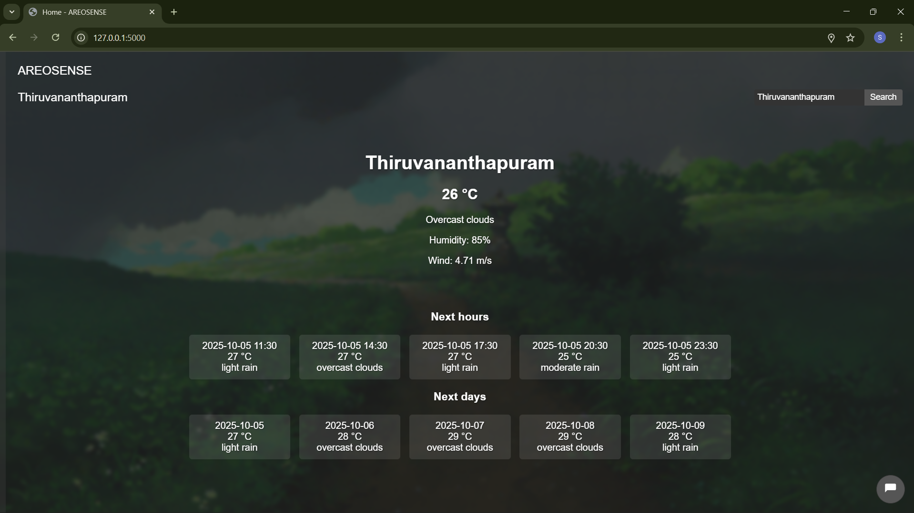
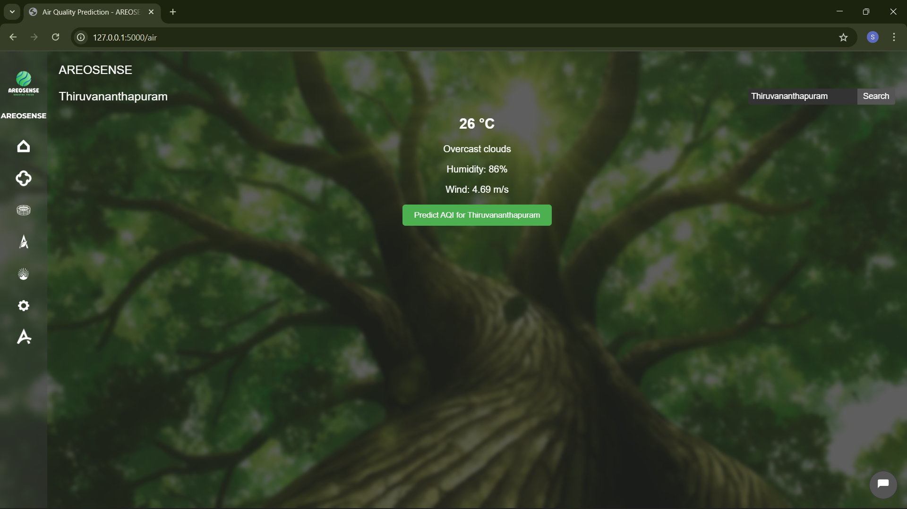
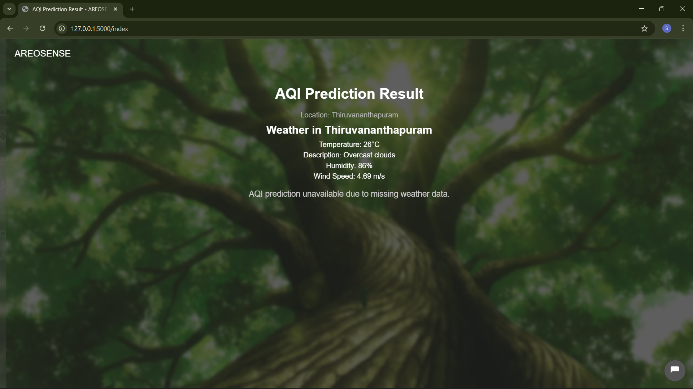
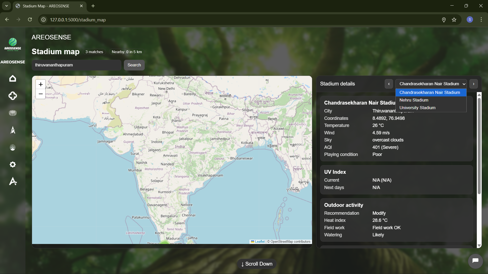
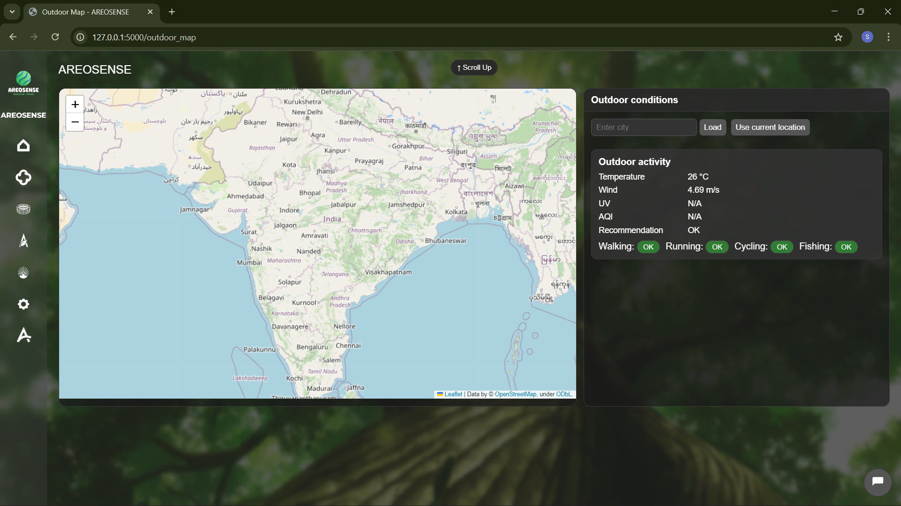
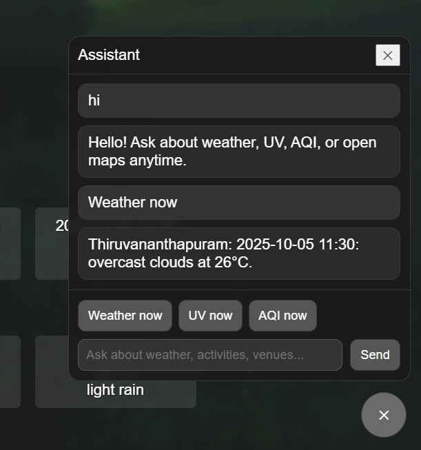

# AEROSENSE
A hackathon‑ready weather application by team Mcatrons featuring current conditions, UV Index, multilingual UI scaffolding, an embedded AI assistant drawer, and a stadium map experience.
Built as a Flask server‑rendered app with Jinja templates, the project emphasizes quick setup, consistent layout via base.html, and extensibility for additional data sources and views

### Application tested on:

- python 3.9.0


python 3.9.0 is a stabled version so we can use the esensial library's


### Using `venv`

1. Make a virtual environment using `venv` and activate it
```
venv\Scripts\activate

make sure the file location is correct the project is with in a folder  
```
2. Install python dependencies
```
pip install -r requirements.txt
```
3. Run the webapp. Be sure to set the appropriate values in `app.yaml` file before running the application.
```
python app.py
```
## Feature

* Weather and UV Index via OpenWeather One Call 3.0, integrated server‑side for reliable rendering in templates.

* Internationalization scaffolding in base.html for multi‑language UI readiness and centralized string hooks.

* Embedded AI assistant drawer with a floating trigger button for in‑context help across all pages.

* Stadium map page with a Folium map and live‑updating details panel wired to a dedicated route.


## Project Previews

# Home Page

# AQI Prediction Page

# Stadium Location & Weather Page

# Outdoor Activity Page

# Agriculture Activity Weather page

# Settings page

# AI Assistant Window 



### Tested environment 
* The application is implemented as a Flask server with Jinja templates and runs in a standard Python 3 environment consistent with app.py usage patterns.
* If a pinned Python version is required for dependencies, capture it here once finalized during environment setup and dependency resolution for reproducible installs.


### Using a virtual environment
* Create and activate a virtual environment using venv to isolate dependencies for development and testing.

* Install project dependencies as defined in the repository to ensure consistent runtime behavior across machines.

## Installation
* Prefer installing from a requirements.txt to capture all transitive dependencies in a reproducible manner for the Flask app.

* If a system‑specific workaround is needed, document the additional steps here after validating in local and CI environments to avoid version conflicts.


* python app.py


## Modules
* Weather and UV: Server routes fetch current conditions and UV Index from OpenWeather One Call 3.0 and inject them into Jinja templates for display.

* Internationalization: The base template provides localization hooks so strings can be translated and toggled as the project adds languages.

* AI Assistant: A drawer UI appended to base.html offers help and quick actions throughout the app via a non‑intrusive floating button.

* Stadium Map: A dedicated page renders a Folium map with a details panel that updates when a stadium is selected, connected to a /stadium_map route.

## Routes
* Home: The main page rendered from app.py shows current weather and UV metrics using data fetched on the server side for reliable presentation.

* Stadium Map: The /stadium_map route loads the Folium map and side panel for stadium selection and context details in a split‑view layout.

## Architecture
* Backend: Flask routes orchestrate data retrieval, including OpenWeather One Call 3.0, and render Jinja templates with a consistent layout.

* Frontend layout: base.html centralizes navigation, styles, scripts, i18n hooks, and the assistant drawer so features are globally available.

## Acknowledgments
* Weather and UV Index data powered by OpenWeather’s One Call 3.0, integrated in server routes for stable rendering.

## Future Enhancements 

# Assistant UX
* Add quick actions as persistent chips (UV, AQI, Best time, Open maps) that persist across pages via sessionStorage so transitions don’t reset context.

* Enable voice input/output in the drawer using the Web Speech API for hands‑free queries like “UV in Kochi now,” respecting the existing drawer and message flow.

# Personalization
* Remember preferred cities, units, date/time formats, and map zoom per route using the session preferences already injected into templates, and surface them as one‑tap chips in each map page.

* Offer profiles for “Athlete,” “Farmer,” and “Event staff” to change default cards and tips per page (e.g., show agri advice first on Agriculture and outdoor training windows first on Outdoor).

# Map interactions
* Lazy‑load Folium layers and cluster markers for large datasets to keep interactions smooth while retaining the current Leaflet plumbing used in Stadium/Outdoor/Agriculture pages.

* Add “Navigate by scroll” hints and a small minimap/compass overlay that shows where up/down leads (Stadium ↔ Agriculture ↔ Outdoor), consistent with current scroll navigation patterns.

# Performance
* Cache weather/AQI responses per city for short TTLs (e.g., 2–5 minutes) server‑side to reduce API calls and speed page renders while preserving current template context injection.

* Defer noncritical JS and inline critical CSS for the base shell to improve first contentful paint without altering the assistant’s toggle behavior or overlay.

# Accessibility
* Ensure drawer controls and chips have ARIA labels and tab order; add “Reduce motion” detection and respect it in all page‑fade transitions already present on maps.

* Provide high‑contrast theme and larger touch targets for top/bottom CTA links on Agriculture and Outdoor pages for better mobile ergonomics.

# Internationalization
* Expand Babel locales beyond en/hi/ml/ta and add runtime language toggle in the assistant footer, reusing the locale selector that stores language in session.

* Localize units/phrasing in cards (e.g., “Heat index,” “Best time”) by wrapping those strings with gettext and shipping per‑locale templates where needed.

# Offline and resilience
* Add a service worker for offline fallback tiles and cached last‑known weather so the maps/pages render basic info even with flaky connectivity, using the stubbed SW hook already noted in the base layout.

* Gracefully degrade Folium interactivity to a static map image if Leaflet fails to initialize, keeping the right‑pane cards and assistant usable.

# Data quality and insights
* Add confidence bands to forecasts and show data sources/time stamps in cards, aligning with the existing “Next hours/Next days” sections and advice blocks.

* Compute simple risk scores (heat stress, poor air, wind caution) and color the page header or chip badges to match conditions without changing current card structure.

# DevOps and safety
* Move the Flask secret key to environment variables and rotate keys across environments; add a simple health endpoint and request logging with redaction.

* Add rate limiting for the /assistant/chat route and validate input size to prevent abuse while maintaining the current JSON shape and options/deep_link fields.
