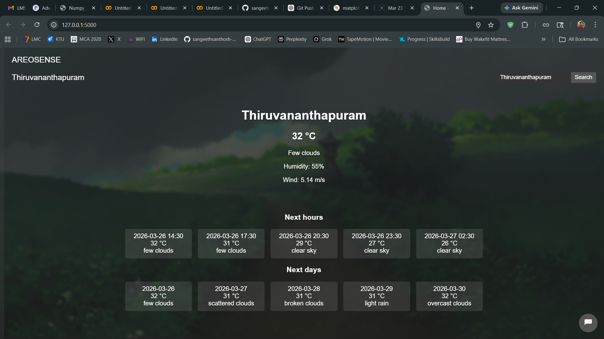
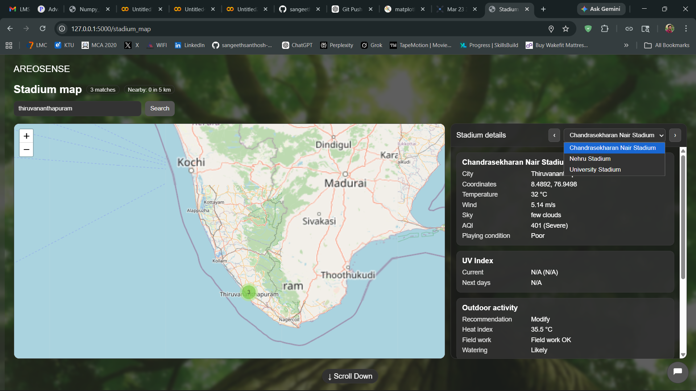

# 🌫️ AEROSENSE

AEROSENSE is a Flask-based air quality prediction system that combines weather intelligence, historical pollution data, interactive maps, and machine learning workflows into a single web application. The project is designed to help users understand current environmental conditions, explore city-level AQI patterns, and view activity-specific recommendations for outdoor, agricultural, and sports use cases.

## 🎯 Problem Statement

Air pollution directly affects health, travel, sports, and daily outdoor activity, yet environmental information is often scattered across multiple platforms. AEROSENSE addresses this by bringing weather insights, AQI-oriented datasets, and predictive workflows together in one accessible interface for faster, more informed decisions.

## ✨ Features

- Flask web application with Jinja2 templates and static assets
- City search and geolocation-based weather lookup
- AQI prediction flow using weather-derived input features
- Historical air-quality exploration from CSV datasets in `city_air/`
- Interactive Folium map views for stadium, outdoor, and agriculture scenarios
- UV index and contextual activity advice cards
- Embedded assistant chat route for quick in-app guidance
- Language and preference settings using Flask-Babel session support
- Machine learning experimentation notebooks for AQI modeling

## 🛠️ Tech Stack

- Backend: Python, Flask, Flask-Babel
- Data Processing: Pandas, NumPy
- Visualization: Matplotlib, Seaborn, Folium
- Machine Learning: scikit-learn
- Frontend: HTML, CSS, JavaScript, Jinja2
- Data Sources: Local CSV datasets, OpenWeather API, venue mapping data

## 🧭 Architecture Flow

```text
User input / geolocation
        |
        v
Flask routes in app.py
        |
        +--> OpenWeather API --> current weather / forecast / UV --> templates
        |
        +--> city_air/city1_day.csv --> preprocessing --> AQI bucket / pollution views
        |
        +--> weather-derived feature vector --> AQI regressor --> prediction result
        |
        +--> venues.csv + Folium --> stadium / outdoor / agriculture maps
        |
        v
Rendered UI through templates/ + static/
```

## 📁 Folder Structure

```text
AEROSENSE/
├── app.py
├── requirements.txt
├── model.pkl
├── index.pkl
├── solution.pkl
├── venues.csv
├── merge_datasets.py
├── app.yaml
├── appengine_config.py
├── docs/
│   └── img/
│       ├── home.png
│       ├── aqi predict.png
│       └── stadium.png
├── city_air/
│   ├── city_day.csv
│   ├── city1_day.csv
│   └── city.py
├── model/
│   ├── code.py
│   └── price.csv
├── ML_Algorithms/
│   ├── AQI_ExtraTreesRegressor.ipynb
│   ├── AQI_XgboostRegressor.ipynb
│   ├── AQI_Decision_Tree2.ipynb
│   └── AOI_SVR (1).ipynb
├── ML_Applied_Word/
│   └── PreProcess/
│       ├── AQI_linear_regressor.ipynb
│       ├── extract_combinedata.py
│       └── web_scrap_code.py
├── templates/
│   ├── base.html
│   ├── home.html
│   ├── prediction.html
│   ├── result.html
│   ├── pollution.html
│   ├── stadium_map.html
│   ├── outdoor_map.html
│   ├── agri_map.html
│   ├── settings.html
│   ├── about.html
│   └── partials/
├── static/
│   ├── css/
│   ├── images/
│   └── assets/
├── pest/
└── soil Fertility/
```

## 🚀 Installation

1. Clone the repository.
2. Create and activate a virtual environment.
3. Install dependencies:

   ```bash
   pip install -r requirements.txt
   ```

4. Update the OpenWeather API key in `app.py` before running the app.
5. Start the Flask server:

   ```bash
   python app.py
   ```

> Recommended environment: Python 3.9.0. The included `app.yaml` is a legacy App Engine configuration and may require modernization for deployment.

## ▶️ Usage

1. Launch the app locally and open the provided Flask URL in your browser.
2. Search for a city or allow geolocation on the home page.
3. Navigate through AQI prediction, pollution views, stadium map, outdoor map, and agriculture map pages.
4. Use the settings page to adjust language, units, and user preferences.

## 🤖 Model Details

- `model.pkl` is a serialized scikit-learn `LinearRegression` model generated from `model/code.py` and serves as a bundled sample artifact.
- AQI-focused experimentation is stored in the notebooks under `ML_Algorithms/`, including Decision Tree, Extra Trees, SVR, and XGBoost approaches.
- The main prediction route in `app.py` builds an 8-feature weather input vector and is intended to use `tree_gridcv.pkl`, which is referenced in code but not committed in this repository.
- `index.pkl` and `solution.pkl` are preprocessed AQI-ready DataFrame artifacts, each containing `24,850` rows and `17` columns.

## 📊 Dataset Description

- `city_air/city_day.csv`: `29,531` daily AQI records across `26` Indian cities from `2015-01-01` to `2020-07-01`
- `city_air/city1_day.csv`: `12,524` station-wise pollutant records across `260` cities, used for in-app preprocessing and AQI bucket generation
- `venues.csv`: `85` mapped sports venues used by the stadium weather and playing-condition view
- `merge_datasets.py`: utility script to merge historical city data with newer WAQI-based air-quality records

## 🖼️ Screenshots

### Home Dashboard



### AQI Prediction


### Stadium Map



## 🔮 Future Improvements

- Add and version the production AQI model artifact used by the prediction route
- Move API keys and secret values to environment variables
- Add evaluation metrics, reproducible training steps, and model comparison summaries
- Introduce scheduled data refresh pipelines for live AQI updates
- Modernize deployment configuration and add container support
- Expand test coverage for preprocessing, routes, and prediction logic

## 👤 Author

Sangeeth Santhosh  
Team Mcatrons

## 📄 License

This repository does not currently include an explicit license file. Add a project license before public distribution or reuse.
